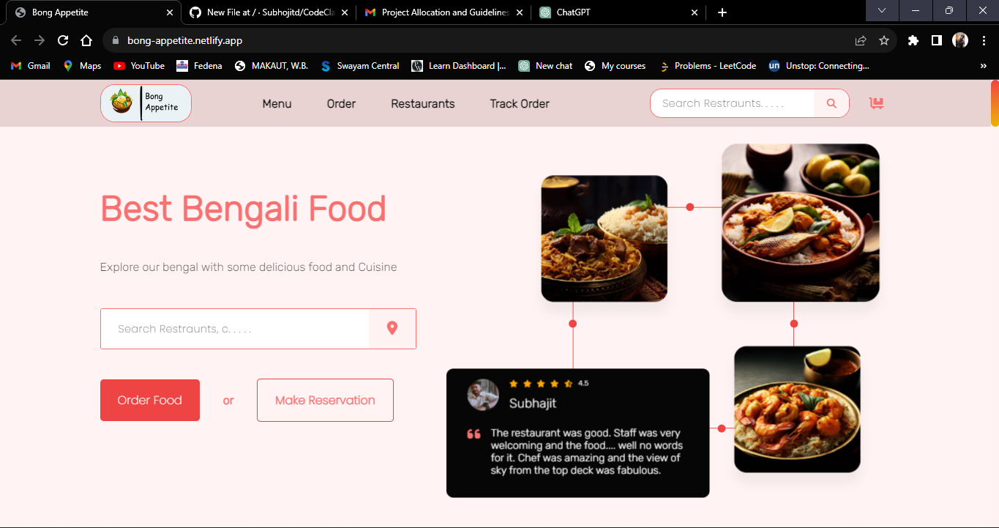

# Bengali Food Delivery Website Landing Page

This project was completed as part of a task assigned by CodeClause to create a captivating landing page for a Bengali food delivery website. The landing page showcases a visually appealing design, featuring animations and an intuitive user interface that aims to engage and entice visitors to explore the website further.

## Table of Contents

- [Project Overview](#project-overview)
- [Features](#features)
- [Animations](#animations)
- [UI Design](#ui-design)
- [Getting Started](#getting-started)
- [Technologies Used](#technologies-used)

## Project Overview

The objective of this project was to design a landing page for a Bengali food delivery website, focusing on creating an immersive experience for visitors. The website introduces users to the diverse range of Bengali cuisine available for delivery, while also reflecting the cultural essence of Bengal.

## Features

- **Interactive Navigation:** The landing page features an intuitive navigation menu that enables users to easily explore various sections of the website.

- **Cuisine Showcase:** A visually appealing display of Bengali dishes entices users to explore the culinary offerings of the website.

- **Ordering Process:** Clear call-to-action buttons guide users through the ordering process, making it seamless and user-friendly.

- **Animation Effects:** Animations are incorporated throughout the landing page to add a dynamic and captivating element to the user experience.

- **Responsive Design:** The landing page is designed to be responsive, ensuring a consistent and enjoyable user experience across different devices.

## Animations

The use of animations is a key highlight of the landing page. Subtle animations have been strategically implemented to create a sense of interactivity and engagement. From hover effects on buttons to smooth transitions between sections, animations contribute to a polished and modern feel.

## UI Design

The user interface (UI) design of the landing page emphasizes clarity and aesthetics. The color scheme reflects the vibrancy of Bengali culture, and the typography is chosen to ensure easy readability. The layout is designed to guide users' attention to the most important elements, such as the menu, featured dishes, and ordering options.

## Getting Started

To view the landing page, simply navigate to the provided URL:https://bong-appetite.netlify.app/

## Technologies Used

- HTML5
- CSS3
- JavaScript
- Animation Libraries (e.g., Animate.css, AOS)

---

Feel free to reach out to the project lead or contributors for any questions, feedback, or suggestions. We hope you enjoy exploring the flavorful world of Bengali cuisine through our captivating landing page!
